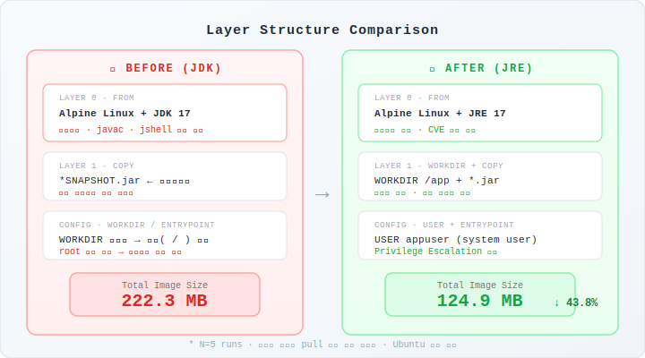
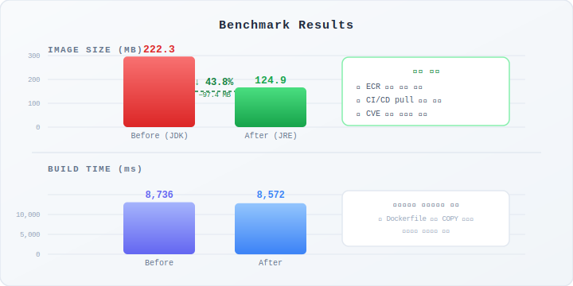
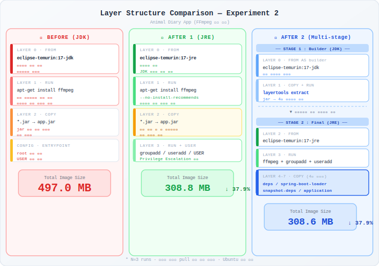
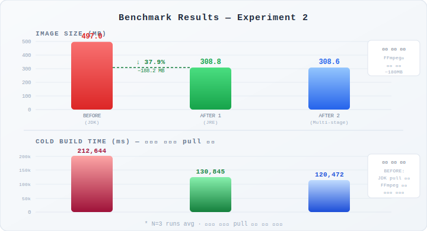
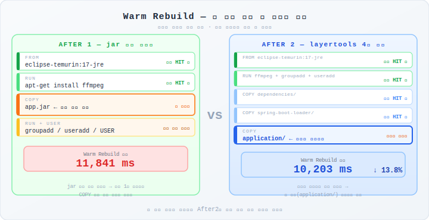
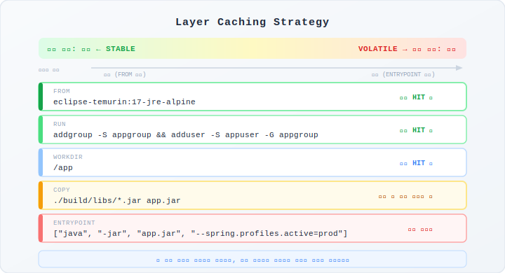

# Docker Image Optimization — Spring Boot

> JDK → JRE 전환, 보안 강화, 멀티스테이지 빌드를 통한 컨테이너 이미지 최적화 실무 적용 사례

---

## 목차

- [배경 및 문제 정의](#배경-및-문제-정의)
- [실험 1: ValanSe — JDK → JRE + 보안 강화](#실험-1-valanse--jdk--jre--보안-강화)
- [실험 2: Animal Diary — FFmpeg 환경 멀티스테이지 빌드](#실험-2-animal-diary--ffmpeg-환경-멀티스테이지-빌드)
- [핵심 개념 정리](#핵심-개념-정리)

---

## 배경 및 문제 정의

컨테이너 이미지는 작을수록, 보안은 최소 권한 원칙을 따를수록, 빌드는 캐시를 잘 활용할수록 좋다. 두 프로젝트의 Dockerfile을 분석해 비효율적인 부분을 단계적으로 개선했다.

| 문제 | 설명 |
|------|------|
| **불필요한 이미지 크기** | JDK에는 컴파일러·디버거·개발 도구가 포함되어 있어 실행 전용 환경에 부적합 |
| **보안 취약점** | root 사용자로 컨테이너 실행 시 탈출 공격에 취약 |
| **빌드 캐시 비효율** | jar 전체를 단일 레이어로 묶으면 코드 한 줄만 바꿔도 전체 재빌드 발생 |

---

## 실험 1: ValanSe — JDK → JRE + 보안 강화

### Dockerfile 변경 사항

**Before**

```dockerfile
FROM eclipse-temurin:17-jdk-alpine
COPY ./build/libs/*SNAPSHOT.jar app.jar
ENTRYPOINT ["java", "-jar", "app.jar", "--spring.profiles.active=default"]
```

**After**

```dockerfile
FROM eclipse-temurin:17-jre-alpine

WORKDIR /app

COPY ./build/libs/*.jar app.jar

RUN addgroup -S appgroup && \
    adduser -S appuser -G appgroup

USER appuser

ENTRYPOINT ["java", "-jar", "app.jar", "--spring.profiles.active=default"]
```

**레이어 구조 비교**



| 항목 | Before | After | 이유 |
|------|--------|-------|------|
| 베이스 이미지 | `eclipse-temurin:17-jdk-alpine` | `eclipse-temurin:17-jre-alpine` | 실행 전용 환경에는 JRE로 충분 |
| WORKDIR | 없음 (루트에서 실행) | `/app` | 작업 경로 명시로 레이어 예측성 향상 |
| JAR 패턴 | `*SNAPSHOT.jar` | `*.jar` | 불필요한 네이밍 제약 제거 |
| 실행 유저 | `root` | `appuser` (system user) | Privilege Escalation 방어 |

---

### 벤치마크 결과

> 측정 조건: N=5 runs, 베이스 이미지 pull 포함 완전 초기화, Ubuntu 서버 환경



| 항목 | Before (JDK) | After (JRE) | 개선 |
|------|:---:|:---:|:---:|
| 평균 빌드 시간 | 8,736 ms | 8,572 ms | −1.9% (오차 범위) |
| **이미지 크기** | **222.3 MB** | **124.9 MB** | **−43.8%** |

<details>
<summary>raw 측정값 보기</summary>

```
Run결과 (BEFORE)          Run결과 (AFTER)
  Run 1: 10,099ms           Run 1:  8,990ms
  Run 2:  8,637ms           Run 2:  9,095ms
  Run 3:  8,221ms           Run 3:  8,261ms
  Run 4:  8,802ms           Run 4:  8,158ms
  Run 5:  7,923ms           Run 5:  8,358ms
  ─────────────────         ─────────────────
  Avg  :  8,736ms           Avg  :  8,572ms
  Size : 222.3 MB           Size : 124.9 MB
```

</details>

**결과 해석**

- **이미지 크기 97.4 MB 감소**: ECR 등 컨테이너 레지스트리 저장 비용 절감, CI/CD Cold Start 환경에서 pull 속도 향상
- **빌드 시간 차이 없음**: 두 Dockerfile 모두 `COPY` 한 번이 실제 빌드 작업의 전부이므로 레이어 처리량이 동일 → 통계적으로 유의미하지 않음

---

## 실험 2: Animal Diary — FFmpeg 환경 멀티스테이지 빌드

### 실험 환경과 문제 정의

Animal Diary 앱은 사진·동영상 처리를 위해 **FFmpeg**가 필요한 환경이다. FFmpeg는 영상·음성 변환을 담당하는 대형 미디어 처리 라이브러리로, 설치하면 수십 개의 종속 패키지가 함께 딸려온다.

> **비전공자용 설명**: FFmpeg는 "동영상 편집 도구 모음"이라고 생각하면 된다. 설치할 때 관련 부속품이 박스 5개 분량으로 따라온다. 그래서 빌드 시간이 3분이나 걸리는 것이다. 인터넷에서 이 부속품들을 전부 내려받아 설치하는 시간이 대부분이다.

| 문제 | Before 상태 | 영향 |
|------|------------|------|
| JDK 사용 | 컴파일러까지 실행 이미지에 탑재 | 불필요한 크기 증가 |
| 추천 패키지 포함 | `apt-get install ffmpeg` 기본값 | 사용 안 하는 패키지까지 설치 |
| jar 단일 레이어 | COPY 하나로 전체 묶음 | 코드 변경마다 전체 재빌드 |
| root 실행 | USER 지정 없음 | 컨테이너 탈출 시 호스트 위협 |

---

### Dockerfile 변경 사항

**Before** — JDK + FFmpeg, root 실행, 단일 jar 레이어

```dockerfile
FROM eclipse-temurin:17.0.12_7-jdk
RUN apt-get update && \
    apt-get install -y ffmpeg && \
    apt-get clean && \
    rm -rf /var/lib/apt/lists/*
ARG JAR_FILE=/build/libs/*.jar
COPY ${JAR_FILE} app.jar
ENTRYPOINT ["java","-jar","/app.jar"]
```

**After 1** — JRE + `--no-install-recommends` + non-root

```dockerfile
FROM eclipse-temurin:17.0.12_7-jre

WORKDIR /app

RUN apt-get update && \
    apt-get install -y --no-install-recommends ffmpeg && \
    apt-get clean && \
    rm -rf /var/lib/apt/lists/*

ARG JAR_FILE=/build/libs/*.jar
COPY ${JAR_FILE} app.jar

RUN groupadd -r appgroup && \
    useradd -r -g appgroup appuser

USER appuser

ENTRYPOINT ["java", "-jar", "/app.jar"]
```

**After 2** — 멀티스테이지 빌드 + layertools로 jar 4개 레이어 분리

```dockerfile
# Stage 1: JAR 레이어 분리 (최종 이미지에 포함되지 않음)
FROM eclipse-temurin:17.0.12_7-jdk AS builder
WORKDIR /app
ARG JAR_FILE=/build/libs/*.jar
COPY ${JAR_FILE} app.jar
RUN java -Djarmode=layertools -jar app.jar extract

# Stage 2: 실행 이미지 (이것만 배포됨)
FROM eclipse-temurin:17.0.12_7-jre
RUN apt-get update && \
    apt-get install -y --no-install-recommends ffmpeg && \
    apt-get clean && \
    rm -rf /var/lib/apt/lists/* && \
    groupadd -r appuser && useradd -r -g appuser appuser
WORKDIR /app
COPY --from=builder /app/dependencies/ ./
COPY --from=builder /app/spring-boot-loader/ ./
COPY --from=builder /app/snapshot-dependencies/ ./
COPY --from=builder /app/application/ ./
USER appuser
ENTRYPOINT ["java", "org.springframework.boot.loader.launch.JarLauncher"]
```

**레이어 구조 비교**



| 항목 | Before | After 1 | After 2 |
|------|--------|---------|---------|
| 베이스 이미지 | JDK (무거움) | JRE (경량) | JRE (경량) |
| FFmpeg 설치 | 추천 패키지 포함 | `--no-install-recommends` | `--no-install-recommends` |
| jar 구조 | 단일 레이어 | 단일 레이어 | 4개 레이어 분리 |
| 실행 유저 | root | appuser | appuser |
| 빌드 스테이지 | 1개 | 1개 | 2개 (builder + final) |

---

### 벤치마크 결과

> 측정 조건: N=3 runs, 베이스 이미지 pull 포함 완전 초기화, Ubuntu 서버 환경



**Phase 1: Cold Build (풀 재빌드)**

| 항목 | Before (JDK) | After 1 (JRE) | After 2 (Multi-stage) |
|------|:---:|:---:|:---:|
| 평균 빌드 시간 | 212,644 ms | 130,845 ms | 120,472 ms |
| **이미지 크기** | **497.0 MB** | **308.8 MB** | **308.6 MB** |
| 크기 절감 | 기준 | **−37.9%** | **−37.9%** |

**Phase 2: Warm Rebuild (앱 코드 변경 시)**



| 항목 | After 1 (JRE) | After 2 (Multi-stage) | 개선 |
|------|:---:|:---:|:---:|
| 재빌드 시간 | 11,841 ms | 10,203 ms | **−13.8%** |

<details>
<summary>raw 측정값 보기</summary>

```
Phase 1 — Cold Build
  BEFORE               AFTER 1              AFTER 2
  Run 1: 212,900ms     Run 1: 119,061ms     Run 1: 115,024ms
  Run 2: 236,247ms     Run 2: 159,098ms     Run 2: 115,970ms
  Run 3: 188,785ms     Run 3: 114,377ms     Run 3: 130,422ms
  ─────────────────    ─────────────────    ─────────────────
  Avg  : 212,644ms     Avg  : 130,845ms     Avg  : 120,472ms
  Size :   497.0 MB    Size :   308.8 MB    Size :   308.6 MB

Phase 2 — Warm Rebuild
  After 1: 11,841ms
  After 2: 10,203ms  (−13.8%)
```

</details>

---

### 결과 해석

**왜 After 1과 After 2의 이미지 크기가 거의 같은가?**

두 버전 모두 FFmpeg가 포함되어 있고, FFmpeg가 이미지 크기의 대부분(~180 MB)을 차지하기 때문이다. JDK → JRE 전환 효과는 있지만, FFmpeg의 무게가 압도적이라 After 1과 After 2 사이의 차이는 미미하다.

**왜 Cold Build에서 Before가 훨씬 느린가?**

Before는 JDK 이미지(After의 JRE보다 큼)를 pull하는 시간이 추가된다. 나머지 대부분의 시간은 FFmpeg 설치가 차지한다. `--no-install-recommends`로 불필요한 패키지를 제거해도 FFmpeg 자체가 워낙 크기 때문에 절감 효과는 제한적이다.

**After 2의 진짜 장점은 어디에 있는가?**

Cold Build에서의 시간 차이보다 **Warm Rebuild에서의 차이**가 실제 운영에서 더 중요하다. 코드를 배포할 때마다 CI/CD 파이프라인은 이미지를 새로 빌드한다. After 1은 코드를 한 줄만 바꿔도 jar 전체를 다시 패키징한다. After 2는 변경된 `application/` 레이어만 교체하고 의존성 레이어는 캐시를 재사용한다. 배포 횟수가 많을수록 누적 절약 효과가 커진다.

---

## 핵심 개념 정리

### 1. JDK vs JRE

컨테이너 안에서 애플리케이션은 **실행**만 진행한다. 컴파일은 CI 환경에서 Gradle/Maven이 이미 완료하고 JAR로 패키징한 상태이기 때문에, JDK의 개발 도구는 불필요하다.

| | JDK | JRE |
|---|---|---|
| **포함 내용** | 컴파일러(javac) + 런타임 + 개발 도구 전체 | 실행에 필요한 런타임만 |
| **용도** | 소스 코드 작성 및 빌드 | 완성된 JAR 실행 |
| **이미지 크기** | 크다 | 작다 |
| **컨테이너 적합성** | 불필요하게 무거움 | 딱 맞음 |

```dockerfile
# Bad — 컴파일러를 실행 환경에 탑재
FROM eclipse-temurin:17-jdk-alpine

# Good — 실행만 할 거라면 JRE로 충분
FROM eclipse-temurin:17-jre-alpine
```

> 베이스 이미지 한 줄 변경만으로 크기가 20~43% 감소하고, 내장 바이너리 수가 줄어 CVE 노출 가능성도 함께 낮아진다.

---

### 2. 레이어 캐싱 전략

Docker는 **변경된 레이어부터 이하 모든 레이어를 무효화**한다. 자주 바뀌는 레이어는 아래에, 잘 바뀌지 않는 레이어는 위에 배치해야 캐시를 최대한 재사용할 수 있다.



**나쁜 예 — 소스 변경 시마다 의존성 재설치**

```dockerfile
FROM python:3.11
COPY . /app                          # 소스 코드가 위에 있으면 문제
WORKDIR /app
RUN pip install -r requirements.txt  # 위 COPY가 바뀌면 항상 재실행됨
```

**좋은 예 — 의존성 캐시 재사용**

```dockerfile
FROM python:3.11
WORKDIR /app
COPY requirements.txt .              # 의존성 명세만 먼저 복사 (잘 안 바뀜)
RUN pip install -r requirements.txt  # requirements.txt 불변 시 캐시 재사용
COPY . .                             # 소스 코드는 마지막에
```

> 소스 코드가 바뀌어도 `requirements.txt`가 그대로라면 `pip install` 레이어는 캐시를 그대로 사용한다.

---

### 3. 멀티스테이지 빌드

하나의 Dockerfile 안에 여러 `FROM`을 사용해 빌드 환경과 실행 환경을 분리하는 기법이다.

> **비전공자용 설명**: 공장에서 물건을 만들 때와 같다. 용접공이 용접 도구(JDK)로 부품을 조립한 뒤, 배송 트럭(JRE)에는 완성품만 싣는다. 트럭에 용접기까지 실을 필요는 없다.

```dockerfile
# Stage 1: 빌드 환경 (최종 이미지에 포함되지 않음)
FROM eclipse-temurin:17-jdk AS builder
WORKDIR /app
COPY app.jar .
RUN java -Djarmode=layertools -jar app.jar extract

# Stage 2: 실행 환경 (이것만 배포됨)
FROM eclipse-temurin:17-jre
COPY --from=builder /app/dependencies/ ./
COPY --from=builder /app/application/ ./
ENTRYPOINT ["java", "org.springframework.boot.loader.launch.JarLauncher"]
```

**layertools의 역할**

Spring Boot의 `layertools`는 jar 파일을 변경 빈도에 따라 4개 레이어로 분리한다.

| 레이어 | 내용 | 변경 빈도 |
|--------|------|---------|
| `dependencies/` | 외부 라이브러리 (Spring, Jackson 등) | 낮음 — 캐시 HIT |
| `spring-boot-loader/` | Spring Boot 실행기 | 매우 낮음 — 캐시 HIT |
| `snapshot-dependencies/` | SNAPSHOT 의존성 | 낮음 — 캐시 HIT |
| `application/` | 내가 작성한 코드 | **높음 — 항상 변경** |

코드를 수정하면 `application/` 레이어만 교체되고, 무거운 의존성 레이어 3개는 캐시를 그대로 재사용한다.

| 방식 | 코드 변경 후 재빌드 | 이유 |
|------|:---:|------|
| 단일 jar 레이어 (After 1) | jar 전체 재처리 | 레이어 단위가 너무 큼 |
| layertools 분리 (After 2) | application/ 만 교체 | 변경된 레이어만 무효화 |